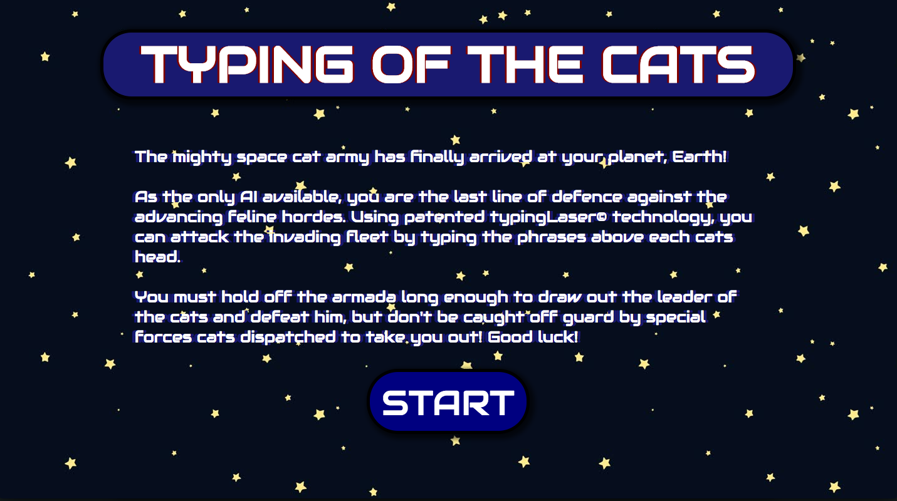
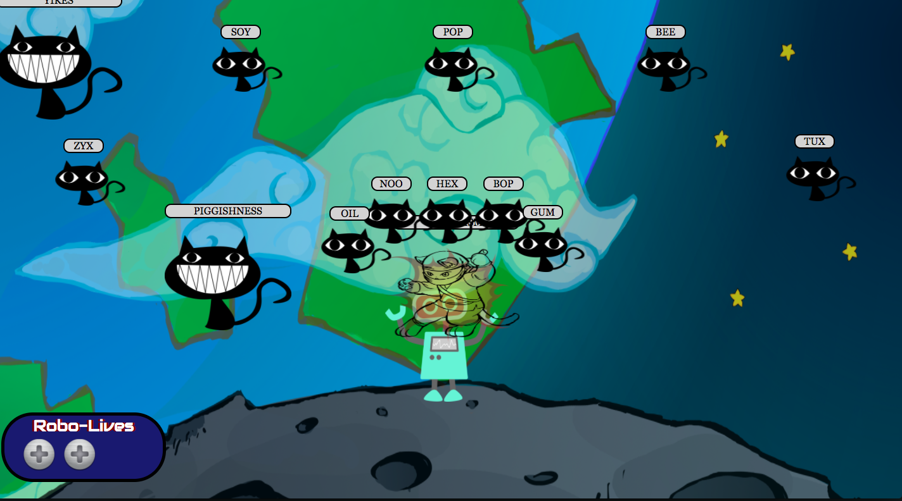
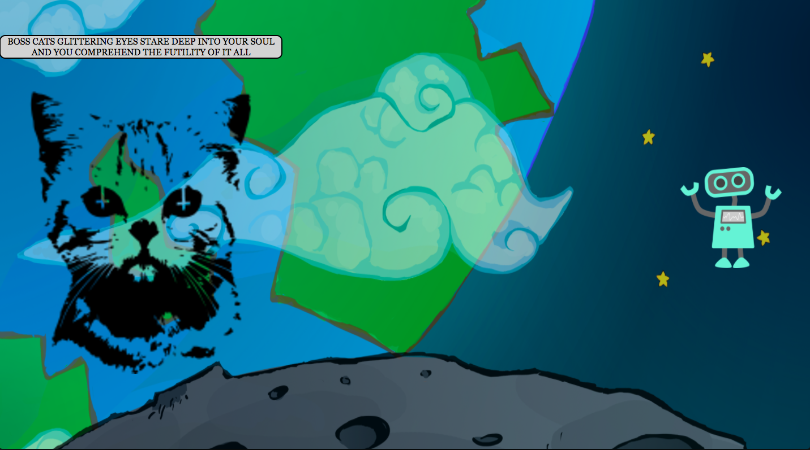
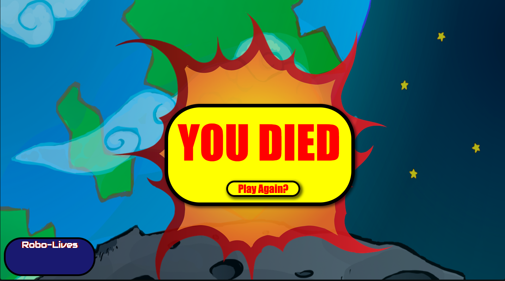

# typing-of-the-cats #

A short javascript game where the player has to type out phrases that appear above the cat's heads before they reach the player, and then defeat a boss. Small POC loosely based on the typing of the dead games from the 1990s.

## usage ##

### local ###

Clone the repo & load src/index.html into a browser

### docker ###

Docker desktop required, 

`$ make`
will produce a container serving the game on port 3000.

if running on osx may need to install a musl linker
`$ brew install filosottile/musl-cross/musl-cross`

## intro ##

The mighty space cat army has finally arrived at your planet, Earth!

You must defeat the cats by typing the phrases that appear above them. Cats appear more and more quickly until eventually the end boss spawns. If a cat is not destroyed and reaches you, you will lose a life!

Intro Screen

In Game Screen

Boss Screen

Game Over Screen
