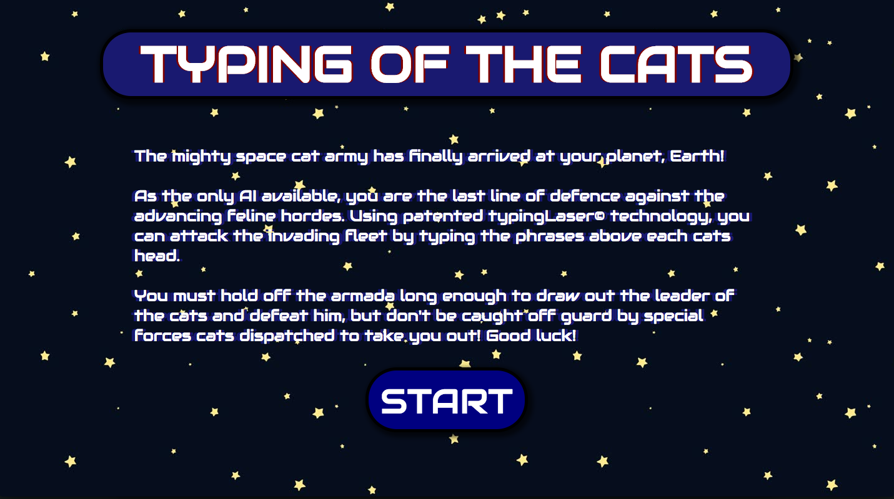
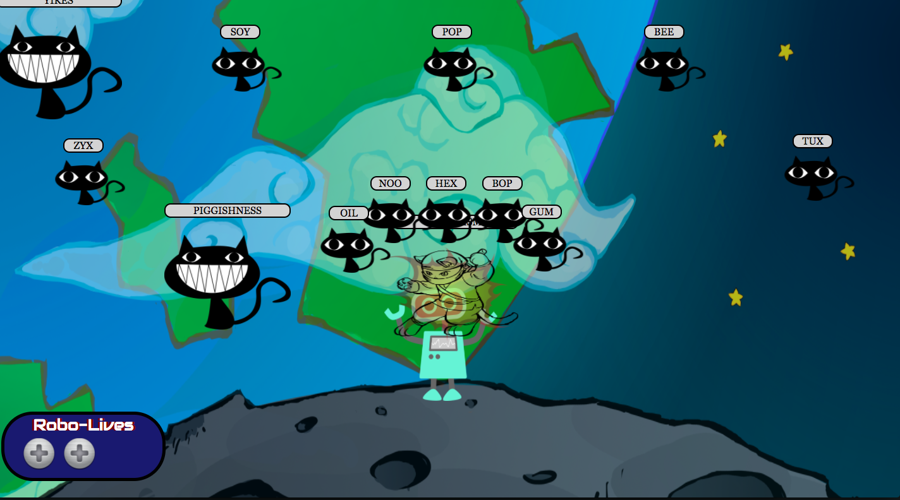
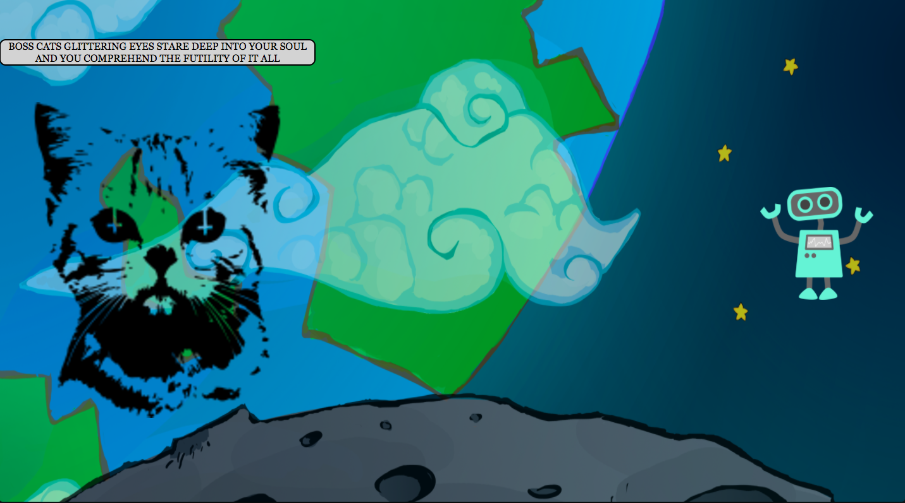
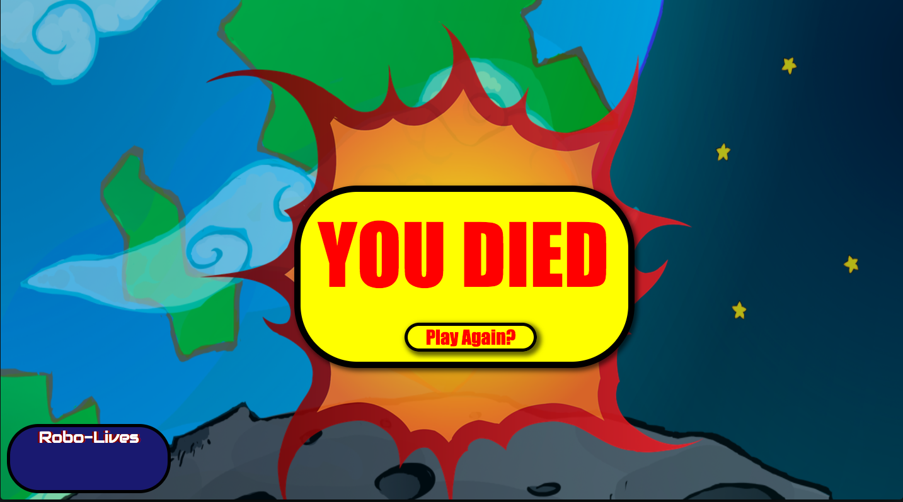

# TYPING OF THE CATS #

A short javascript game where the player has to type out phrases that appear above the cat's heads before they reach the player, and then defeat a boss.

### LANGUAGES UTILISED ###

This project is built in HTML, CSS and Javascript, with the use of the JQuery library.

The bulk of the project was accomplished by heavily manipulating DOMs in javascript, with CSS used for most of the styling and HTML primarily used to contain empty DOM elements as templates for javascript manipulation.

### INSTALLATION ###

The game works simply cloning the repo into your local machine

`git clone git@github.com:jack-a-scott/javascript_game_project.git`

 and loading index.html in any modern browser. The game was made for Chrome but has also been tested in Firefox and Safari.

 #### Docker ####

 `$ make`
 will produce a docker hosting img

 The game is also accessible without cloning the repository at this address.

 [Game Link](https://jack-a-scott.github.io/javascript_game_project)

### INSTRUCTIONS ###

The mighty space cat army has finally arrived at your planet, Earth!

You must defeat the cats by typing the phrases that appear above them. Cats appear more and more quickly until eventually the end boss spawns. If a cat is not destroyed and reaches you, you will lose a life!

Intro Screen

In Game Screen

Boss Screen

Game Over Screen
